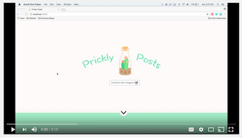

# Prickly Posts
### A digital journaling platform that makes creativity and organization accessible for everyone
##

Our current deployed version: [pricklyposts.herokuapp.com](pricklyposts.herokuapp.com)

Check out a video walk through of Prickly Posts:
[](https://www.youtube.com/watch?v=kEUcZbigSYs&t=13s)


* If you want to log onto Prickly Posts with Instagram, please contact us to become a sandbox user.
* Otherwise, feel free to fork and clone the repo and run on your machine's local host.
```
To run:
$ PORT=3001 node server/bin/www
$ cd client
$ npm start
```

###  Feature list:

 WELCOME TO PRICKLY POSTS
 * The home page features Instagram O-Auth and some razzle dazzle animations
 * Once logging in with Instagram, users are redirected to the Journals page, where they can view all of their journals or create a new journal. Journals are meant to carry a series of entries with similar themes or concepts (e.g., Hopes & Dreams, My Daily, May 2017)
 * The user then selects the journal they want to view or edit.
 * From here, the user can use the *Previous Entry* and *Next Entry* to navigate through all the entries in this journal. Each entry is editable, so the user simply clicks any text field, types new content, and presses the cactus submit button to save the changes.
 * Using the side nav, users can create new entries, delete existing entries and, **best of all, can browse through their recent Instagram photos to select one to display in their journal entry.**


### Technologies Used:
* Instgram API: for login and to render the user's recent photos with the option to insert then into a journal entry
* React: front-end JS framework, enabled dynamic user interface
* Node.<span>js server and PostgreSQL database


If you have any ideas or want to expand on Prickly Posts, please don't hesitate to
contact us!

##

**Note:** You may be wondering why we chose a cactus theme for a digital journaling app. A cactus is resilient, strong and patient for water. Cacti thrive in heat, but it is through the cold, through the harsh conditions, that they grow stronger.

It is our hope, at Prickly Posts, to encouarge users to creatively explore and maybe even  discover the cactus that lives inside themselves.

>"A creative person has to create. It doesn't really matter what you create. If such a dancer wanted to go out and build the cactus gardens where he could, in Mexico, let him do that, but something that is creative has to go on."
>
> Katherine Dunham
